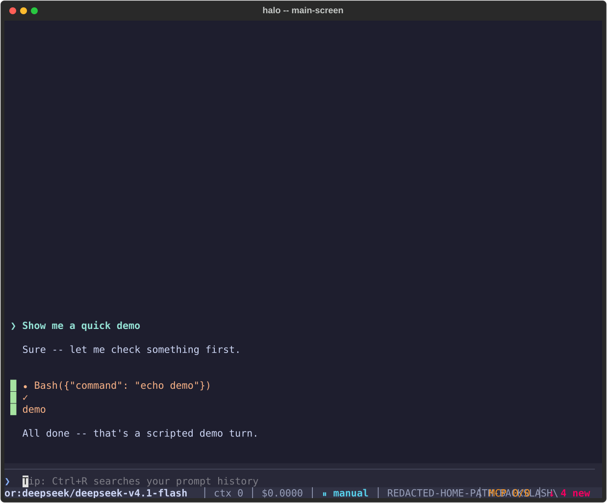
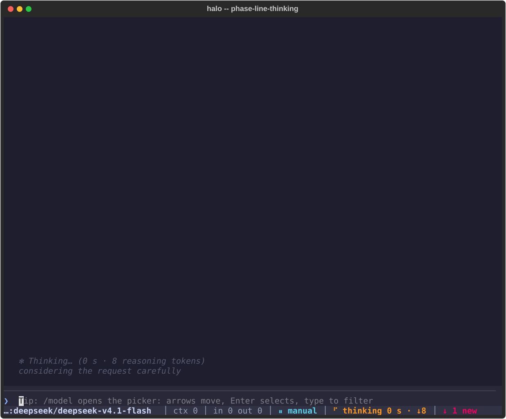

# Halo Harness

**A Claude Code-compatible agent harness that runs the models you choose.**
Halo gives DeepSeek, GLM, Kimi, Qwen and Claude the same tools, the same
configuration and the same working habits as Claude Code, over Databricks,
OpenRouter, the Anthropic API or your Claude Code subscription, and it reads
your existing Claude Code setup so nothing has to be configured twice.

<p align="center">
  
</p>

<p align="center">
  
  
  
  
</p>

## Quick start (Kali / Linux)

Prerequisites: `git`, Python 3.10 or newer, and [`uv`](https://docs.astral.sh/uv/getting-started/installation/)
(`curl -LsSf https://astral.sh/uv/install.sh | sh`, then open a new shell).
One line clones, installs, verifies and runs `halo doctor`:

```sh
curl -fsSL https://raw.githubusercontent.com/roloVibes/Halo-Harness/master/scripts/install-halo.sh | bash
```

Or by hand:

```sh
git clone https://github.com/roloVibes/Halo-Harness.git
cd Halo-Harness
uv tool install --reinstall .   # or: pipx install --force -e .
cd ~                            # cd anywhere: halo is a real command on PATH now
halo init                       # a wizard: provider, model, permission mode, theme, roles, orgs
halo                            # the full-screen TUI
```

No clone at all: `uv tool install git+https://github.com/roloVibes/Halo-Harness`.
[docs/INSTALL.md](docs/INSTALL.md) is the one-page version of this section,
including upgrades and the offline recipe for a locked-down work box.

### Windows

Install `uv` first (`powershell -ExecutionPolicy ByPass -c "irm https://astral.sh/uv/install.ps1 | iex"`,
then open a new terminal), then:

```powershell
git clone https://github.com/roloVibes/Halo-Harness.git
cd Halo-Harness
uv tool install --reinstall .
cd ~
halo init
halo
```

## What it is

Halo is a standalone agent CLI with a full-screen TUI and a print mode. It
has its own agent loop, built-in tools (Read, Write, Edit, Bash, Glob, Grep,
WebFetch, sub-agents and more), an MCP client, hooks, skills, custom
commands, sessions, compaction and plan mode, and it speaks to four kinds of
route:

| Prefix | Route | Credential it finds on its own |
|---|---|---|
| `dbx:` | Databricks model serving, every endpoint a workspace exposes, including its Claude endpoints | `~/.databrickscfg`, `DATABRICKS_HOST`/`DATABRICKS_TOKEN`, a settings `env` block, or the env file |
| `or:` | OpenRouter: DeepSeek, GLM, Kimi, Qwen and hundreds more | `OPENROUTER_API_KEY` in the shell, a settings `env` block, or the env file |
| `ant:` | The Anthropic API | `ANTHROPIC_API_KEY` |
| `cc:` | Your Claude Code subscription, through the installed `claude` | the claude.ai login `claude` already has |

Models that are not Claude get a system prompt written for them: what the
harness is, how each tool works, how CLAUDE.md, memory, skills, MCP servers,
permission modes and plan mode behave, and the working conventions Claude
Code expects. The result is a model that behaves like Claude in Claude Code
on your own infrastructure.

## Intuitive by design

Halo is built so that the first run works and every later run explains itself.

- **It knows where your settings live.** Halo reads Claude Code's own files
  in place: `~/.claude/settings.json` and the project settings for
  permissions, env, hooks and model, `~/.claude.json` and `.mcp.json` for MCP
  servers, every `CLAUDE.md` and `.claude/rules` file on the path, auto-memory,
  skills, commands and agents. Nothing is copied or duplicated.
- **It finds your credentials.** A key in the shell, in a settings `env`
  block, in `~/.databrickscfg`, in Halo's own env file, or a claude.ai login
  that `claude` already holds is enough. Providers enable themselves when a
  credential appears, and `/providers` says which one and why.
- **Any model, one session.** Switch with `/model` in the middle of a
  conversation, from a Databricks endpoint to OpenRouter to your Claude
  subscription, and the session, its history and its tools carry over. The
  picker lists every model Halo has actually enumerated, with context size
  and price, and marks the one you used last.
- **It remembers your choices.** The last model and effort you picked in a
  directory start the next launch there; flags still win; a model whose
  provider disappeared falls back with one line saying so.
- **It never shows a setting it will silently change.** Effort is displayed
  as the value actually sent to the route: `medium (sent as high on this
  route)`. `/status` and `/context` list every parameter a route adjusted.
- **Empty lists explain themselves.** `/mcp` names every scope it searched
  and the count in each, says why a server failed (command not on PATH,
  connection refused, timeout), and lists the claude.ai connectors it can
  reach. `halo doctor` ends every warning with the exact command that fixes
  it.
- **One paste instead of screenshots.** `halo bugreport` writes a redacted
  report of versions, providers, route, mode, the last turn's timeline and
  recent log lines; a planted key never survives redaction.
- **Tips, not a blank box.** The prompt placeholder rotates through short
  tips about commands and features, and every tip is checked against the
  real command registry.

## Fixes: where Halo goes beyond Claude Code

Things people hit in Claude Code that Halo does differently.

- **Auto mode means no prompts.** In `auto` and `bypassPermissions` nothing
  interrupts a turn: no tool-category limits, no browser or MCP carve-outs,
  no protected paths. Only the deny and ask rules and hooks you wrote yourself
  apply. Esc still stops a step, Ctrl+C twice quits.
- **Steer while it works.** Type during a turn and the model changes
  direction at the next chunk; if the model has not produced a byte yet, the
  call is restarted with your message appended.
- **You can always tell it is alive.** A phase line counts from the moment a
  request is sent: `Thinking… (18 s · 412 reasoning tokens)`, `Writing…`,
  `Waiting for model…`, then `Thought for 18 s`. The status bar's spinner,
  elapsed time and received-token counter change every second, running tool
  cards show elapsed seconds, and after 30 s without data the line says so.
- **Permission asks cannot hide.** Pending permission, question and plan
  cards live in a dock above the prompt that stays visible however far you
  have scrolled; concurrent asks from several sub-agents queue instead of
  overwriting each other.
- **Fast launch from any directory.** `halo` starts in well under a second
  from your home directory or any project, with a `--debug` timeline of every
  startup phase. A `claude` wired to a gateway is never probed.
- **The right effort for each gateway.** Databricks GLM accepts only
  low/high/max and treats everything else as max; Halo sends the right level,
  defaults to high instead of the gateway's silent max, and shows what it
  sent. Gateway-specific rules such as gpt-6's tool-call effort are learned
  once and remembered.
- **History and clipboard behave.** Up recalls the prompt you just typed
  (Claude Code's own history is merged without hijacking the order), a typed
  prefix filters the recall, Ctrl+C copies a selection inside the chat box,
  Ctrl+V pastes through your clipboard tool.
- **Weaker models get help where they fail.** Per-family tool guidance, a
  repair layer for text-shaped tool calls, a repeated context hint when an
  Edit match is ambiguous, and `stats --models` showing edit-failure and
  tool-error rates per model so tuning is measured, not guessed.

## Features

- **TUI and print mode.** Claude Code's layout: streaming transcript, tool
  cards with diffs, inline cards, sticky prompt, status bar; `-p` with
  `text`, `json` and `stream-json` output and the same exit codes.
- **Claude Code configuration, unchanged.** Settings precedence, trust,
  permission rule grammar and modes, hooks with Claude Code's protocol and
  payloads, CLAUDE.md chain with imports and rules, auto-memory, skills,
  custom slash commands, sub-agents, `@file` mentions, `!cmd`.
- **MCP.** stdio, HTTP and SSE servers from every Claude Code scope plus
  `--mcp-config`; deferred tools with ToolSearch under provider tool caps;
  `halo mcp serve` exposes Halo's tools as an MCP server; `mcp login` runs a
  generic OAuth flow; claude.ai connectors become `connector__<name>` tools
  any model can call through your Claude Code login.
- **Browser.** `--chrome` connects the Claude in Chrome extension,
  `--playwright` adds the Playwright MCP tools.
- **Sessions.** Resume, continue, fork, `/rewind` with shadow copies of
  edited files, compaction with a checkpoint summary, `/export`.
- **Roles.** `orchestrator`, `coder`, `reviewer`, `researcher` and `small`
  point different kinds of work at different models without editing agent
  files; a local or cheap model can run compaction and summaries.
- **Telemetry and `/improve`.** Per-model repair hits, edit failures, tool
  errors, time to first token and cost from the session logs; `/improve`
  drafts memory and rule candidates from recent failures and writes nothing
  until you approve each one.
- **Databricks at work.** Per-endpoint API types, the 32-tool cap, both
  reasoning wire shapes, rate-limit bodies, a work-matrix probe that turns
  your workspace's live behaviour into per-endpoint settings.
- **Hooks.** Every Claude Code hook event this build fires is listed in
  `docs/COMMANDS.md`; a name Claude Code also recognizes but this build
  doesn't fire yet (`ElicitationRequest`, `ElicitationResponse`) is
  accepted and ignored with a debug line rather than an error.

<p align="center">
  
</p>

## Install

Three ways in, one line each, then `cd anywhere && halo`:

```sh
curl -fsSL https://raw.githubusercontent.com/roloVibes/Halo-Harness/master/scripts/install-halo.sh | bash   # Linux/macOS
uv tool install git+https://github.com/roloVibes/Halo-Harness                                               # any OS, needs uv
pipx install git+https://github.com/roloVibes/Halo-Harness                                                  # any OS, needs pipx
```

Windows: see the Quick start above, or `scripts/install-halo.ps1`'s own
one-liner in [docs/INSTALL.md](docs/INSTALL.md). The full walkthrough, the
offline work-box recipe, PEP 668 notes and reproducible installs via
`requirements.lock` are in [docs/INSTALL.md](docs/INSTALL.md) and
[docs/harness/INSTALL.md](docs/harness/INSTALL.md).

## Update

```sh
halo update            # or /update inside halo -- same check, then updates and restarts
```

Prints installed vs. available and the exact reinstall command for
however `halo` was installed, then (unless `--check`) runs it and reports
the before/after commit. Inside the TUI, `/update` shows the same report
in a dialog -- `Enter` quits, updates (output visible) and relaunches with
`--continue` so the session resumes; `Esc` leaves everything untouched.
That quit-then-update-then-relaunch order is the only safe one on
Windows, where the install can't be replaced while any `halo` process
(this one included) still has it open -- `halo update` on its own refuses
with the same reason if another session is running; `--force` overrides.
`halo --version`/`halo doctor` show what you have now; see "Update" in
[docs/INSTALL.md](docs/INSTALL.md) for the manual command per install kind.

## Models and providers

`halo init` sets up one provider at a time; `halo models` lists what each
enabled provider serves, with context, price and effort levels;
`/model` switches mid-session; `/effort` sets the thinking level a route
really accepts; `/providers` shows enablement, reason and balance. Per-family
behaviour (reasoning replay, temperature, tool-call quirks, effort sets) is
data in `model_table.json`, documented in [docs/MODELS.md](docs/MODELS.md),
with the Databricks specifics in [docs/DATABRICKS.md](docs/DATABRICKS.md) and
roles in [docs/ROLES.md](docs/ROLES.md).

## Local and cloud models (2.0.3)

Halo also runs models you host yourself. `ol:` reaches Ollama -- on this
machine, a LAN host, or Ollama Cloud -- always through its native API so
Halo can size the context window itself; `halo ollama calibrate` turns a
guess into a measured, learned cap. `hf:` reaches Hugging Face: the
shared router (`HF_TOKEN`), a dedicated endpoint, or a local
OpenAI-compatible server (`llama-server`, vLLM, LM Studio) auto-detected
on this machine, plus an experimental Apple Silicon MLX route. `oai:` and
`cx:` reach the real OpenAI API and a Codex ("ChatGPT") subscription.
`halo --offline`/`/offline` blocks every route except the local ones;
`routing.escalation` lets a local-first session fall back to the cloud on
its own terms; and `halo gym` scores your own local models on your own
hardware instead of trusting a vendor claim. See
[docs/LOCAL-MODELS.md](docs/LOCAL-MODELS.md) for the full walkthrough.

## Documentation

| Document | What it covers |
|---|---|
| [docs/INSTALL.md](docs/INSTALL.md) | One-page install, upgrade and update guide |
| [docs/HANDBOOK.md](docs/HANDBOOK.md) | The long-form guide: configuration, config reuse, providers, permissions, steering, hooks, skills, MCP, browser, sessions, print mode, telemetry, troubleshooting, security posture, proxy mode |
| [docs/COMMANDS.md](docs/COMMANDS.md) | Every CLI command and flag |
| [docs/SLASH-COMMANDS.md](docs/SLASH-COMMANDS.md) | Every slash command in the TUI |
| [docs/CONFIG.md](docs/CONFIG.md) | Config keys, paths and environment variables |
| [docs/MODELS.md](docs/MODELS.md) | Model families, effort levels and per-route rules |
| [docs/LOCAL-MODELS.md](docs/LOCAL-MODELS.md) | Ollama, Hugging Face, the OpenAI API and Codex -- the end-to-end guide |
| [docs/DATABRICKS.md](docs/DATABRICKS.md) | Databricks endpoints, API types and the work matrix |
| [docs/ROLES.md](docs/ROLES.md) | Roles and how work is routed to models |
| [docs/TROUBLESHOOTING.md](docs/TROUBLESHOOTING.md) | "Is it frozen?", GLM pauses, copy and paste, connect timeouts and more |
| [docs/ARCHITECTURE.md](docs/ARCHITECTURE.md) | How the pieces fit together |
| [docs/harness/README.md](docs/harness/README.md) | Design briefs, review findings, acceptance records and the model baseline |
| [CHANGELOG.md](CHANGELOG.md) | Every release, with what changed and why |

## Tests

Three hermetic, exit-code-gated suites run on Windows, WSL and a Kali VM
before every commit: `python test_bridge.py` (the proxy), `python
tests/run_all.py` (the harness, 2430 tests across 159 modules) and `python
test_tui.py` (the TUI, through Textual's headless pilot). Mock servers stand
in for every provider, a fake `claude` stands in for the subscription route,
and guards fail the run if a test touches the real `~/.halo` or
`~/.claude`. See [docs/DEVELOPMENT.md](docs/DEVELOPMENT.md).

## Licence

See [LICENSE](LICENSE).
