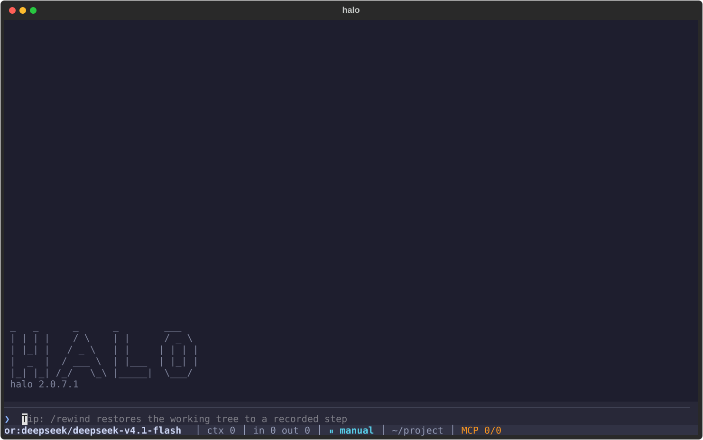
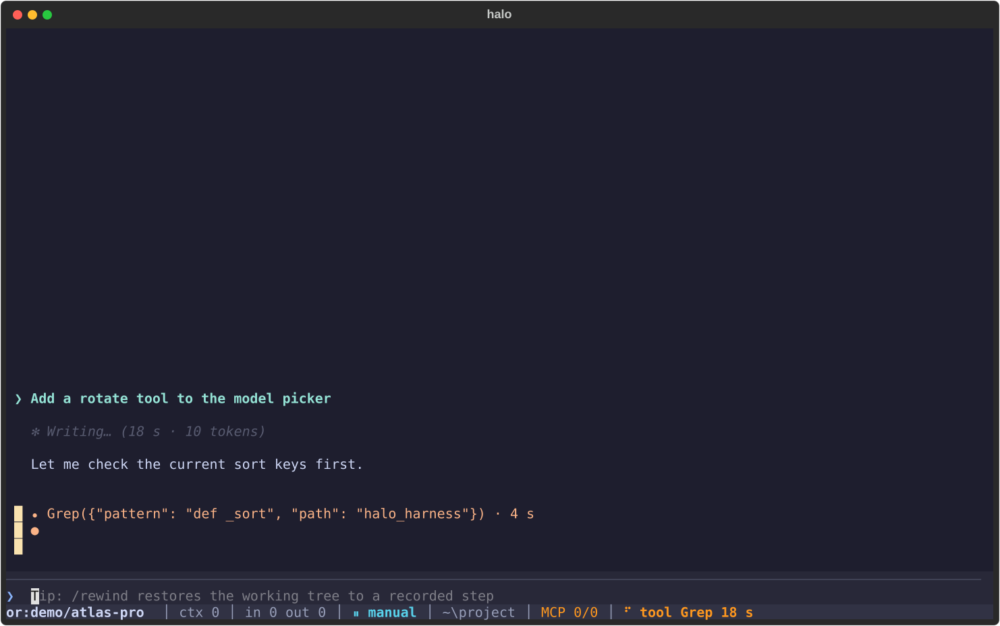
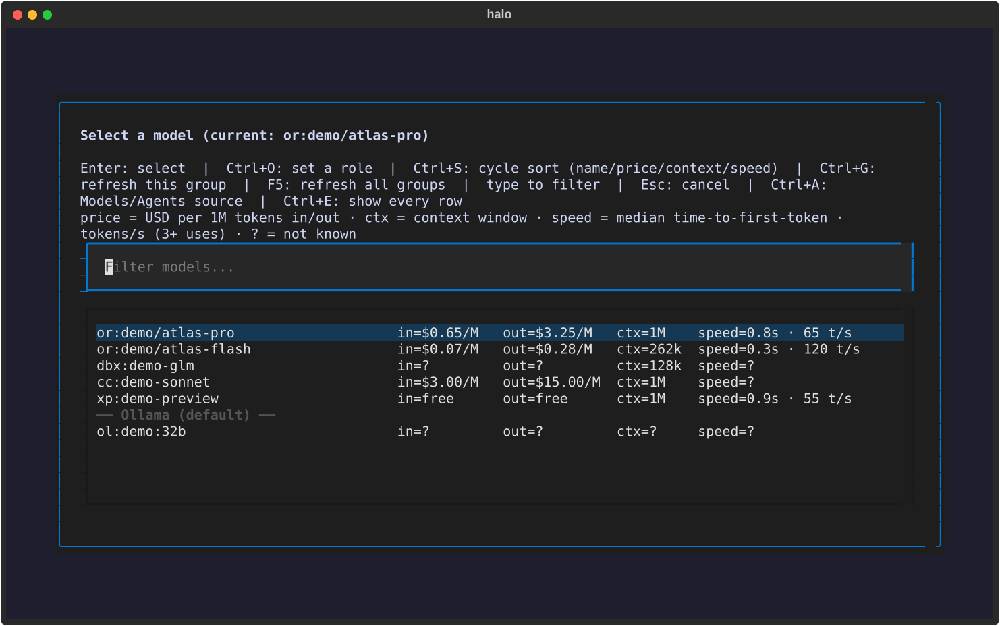
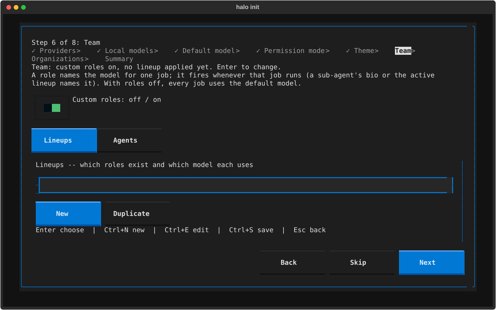
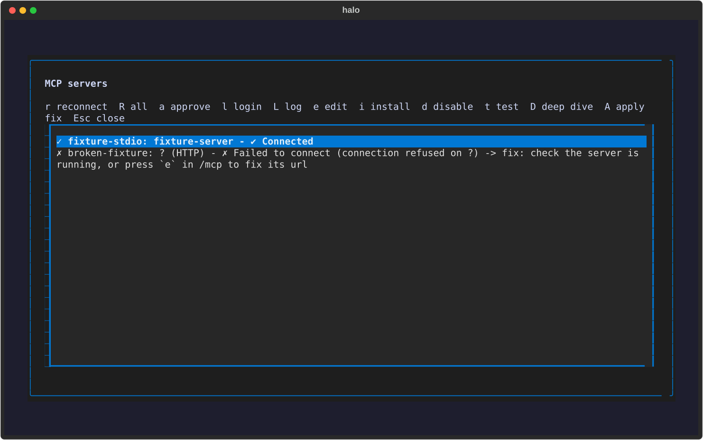
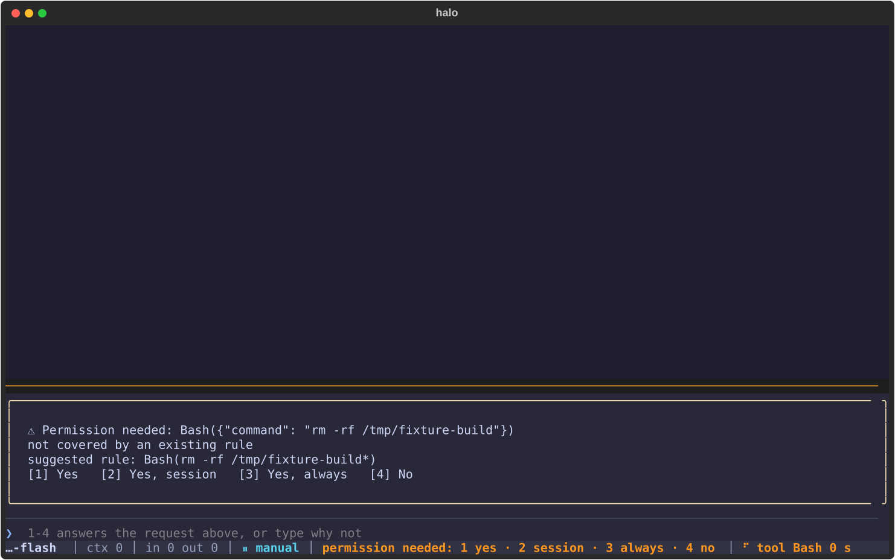
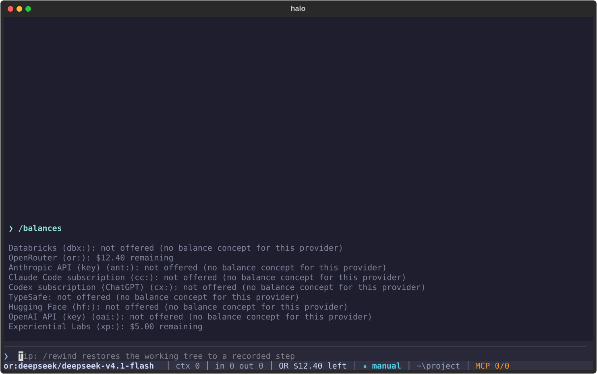

# Halo Harness

```
 _   _      _      _        ___
| | | |    / \    | |      / _ \
| |_| |   / _ \   | |     | | | |
|  _  |  / ___ \  | |___  | |_| |
|_| |_| /_/   \_\ |_____|  \___/
```

**A Claude Code-compatible agent harness that runs the models you choose.**
Halo gives DeepSeek, GLM, Kimi, Qwen and Claude the same tools, the same
configuration and the same working habits as Claude Code -- over Databricks,
OpenRouter, the Anthropic API, your Claude Code subscription, or models you
host yourself -- and it reads your existing Claude Code setup in place
(`~/.claude` settings, CLAUDE.md, skills, commands, agents, MCP servers,
memory), so nothing is configured twice. The same banner prints on
`halo --version`, and the launch intro types it out.

<p align="center">
  
  
  
  
</p>

## What it looks like

Real renders of the TUI, produced by `scripts/screenshots.py` -- Textual
pilots over fixture data with a fixed clock, so a rerun is byte-identical
(`python scripts/screenshots.py && git diff` shows nothing).

| Scene | What it shows |
|---|---|
|  | First paint: the banner intro line, the prompt, the status bar. |
|  | A reply mid-turn: the phase line, a running tool card, live counters. |
|  | The model picker: price, context and speed columns for every route. |
|  | The wizard's Team step: custom roles on, bios and lineups side by side. |
|  | The `/mcp` dialog: one failing server, its reason, the deep-dive action. |
|  | A permission card docked above the prompt with its suggested rule. |
|  | The balances chip in the status bar and the `/balances` table. |

## Features

| | |
|---|---|
| **Routes** | `dbx:` `or:` `ant:` `cc:` `ol:` `hf:` `oai:` `cx:` -- one session, any model, switch mid-conversation with `/model`. |
| **Agent bios and lineups** | YAML agent bios and team templates assign a model per role; `halo teams use <lineup>` applies one. |
| **The wizard** | `halo init`: provider, model, permission mode, theme, roles, orgs -- every step explains itself and `halo doctor` ends each warning with its fix. |
| **MCP deep dive** | stdio/HTTP/SSE servers from every Claude Code scope, `D` diagnoses a failing server end to end, claude.ai connectors bridge through as tools. |
| **Learned rules** | Gateway quirks (effort sets, tool-call shapes) are learned once per model and remembered -- `halo rules` shows them, `--forget-rules` clears them. |
| **Balances and picker columns** | Per-provider balances in the status bar; price, context and speed columns in the picker, with free variants beside their paid rows. |
| **Privacy audit** | `halo audit privacy` scans the tree for real paths, hosts and key-shaped strings; the release refuses to ship one red line. |
| **CI and release script** | Every push runs the three suites on Linux and Windows; `scripts/release.py` versions, tags, pushes and refreshes both installs. |

## Install

```sh
curl -fsSL https://raw.githubusercontent.com/roloVibes/Halo-Harness/master/scripts/install-halo.sh | bash
halo init        # the wizard: provider, model, permission mode, theme, roles
halo             # the full-screen TUI, from any directory
```

Windows: `powershell -ExecutionPolicy ByPass -c "irm https://raw.githubusercontent.com/roloVibes/Halo-Harness/master/scripts/install-halo.ps1 | iex"`.
No installer at all: `uv tool install git+https://github.com/roloVibes/Halo-Harness`
(or `pipx install git+https://github.com/roloVibes/Halo-Harness`). Updates:
`halo update`, or `/update` inside the TUI.
The full walkthrough -- offline work boxes, PEP 668, reproducible installs --
is [docs/INSTALL.md](docs/INSTALL.md).

## Themes

The gallery above is the default theme.

> The 2.0.8 theme pack adds one render each: **DOOM** (a HUD-style status
> bar, `/doom` toggles it and restores your previous theme), **Metroid**,
> and **Mario**.

## Documentation

| Document | What it covers |
|---|---|
| [docs/INSTALL.md](docs/INSTALL.md) | One-page install, upgrade and update guide |
| [docs/HANDBOOK.md](docs/HANDBOOK.md) | The long-form guide: configuration, providers, permissions, steering, hooks, skills, MCP, sessions, telemetry |
| [docs/COMMANDS.md](docs/COMMANDS.md) | Every CLI command and flag |
| [docs/SLASH-COMMANDS.md](docs/SLASH-COMMANDS.md) | Every slash command in the TUI |
| [docs/CONFIG.md](docs/CONFIG.md) | Config keys, paths and environment variables |
| [docs/MODELS.md](docs/MODELS.md) | Model families, effort levels and per-route rules |
| [docs/LOCAL-MODELS.md](docs/LOCAL-MODELS.md) | Ollama, Hugging Face, the OpenAI API and Codex -- end to end |
| [docs/DATABRICKS.md](docs/DATABRICKS.md) | Databricks endpoints, API types and the work matrix |
| [docs/ROLES.md](docs/ROLES.md) | Roles, agent bios and lineups |
| [docs/GOVERNOR.md](docs/GOVERNOR.md) | The Governor: shared per-host rate limiting, failover and lanes |
| [docs/TROUBLESHOOTING.md](docs/TROUBLESHOOTING.md) | "Is it frozen?", GLM pauses, copy and paste, connect timeouts |
| [docs/ARCHITECTURE.md](docs/ARCHITECTURE.md) | How the pieces fit together |
| [docs/harness/README.md](docs/harness/README.md) | Design briefs, review findings, acceptance records |
| [CHANGELOG.md](CHANGELOG.md) | Every release, with what changed and why |

## Tests

Three hermetic, exit-code-gated suites run on Windows, WSL and a Kali VM
before every commit, and in CI on every push: `python test_bridge.py` (the
proxy), `python tests/run_all.py` (the harness) and `python test_tui.py`
(the TUI, through Textual's headless pilot). Mock servers stand in for every
provider, a fake `claude` stands in for the subscription route, and guards
fail the run if a test touches the real `~/.halo` or `~/.claude`. See
[docs/DEVELOPMENT.md](docs/DEVELOPMENT.md).

## Licence

See [LICENSE](LICENSE).
